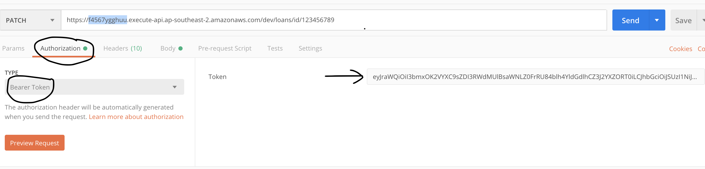

# AWS Cognito Token Requestor

This utility application will get an AWS Cognito web token from the User Pool.
Once one has the token, use it in [Postman](https://www.getpostman.com/) to test your APIs.

## Getting started
- Download [nodejs](https://nodejs.org/en/download/).
- Clone the source code

Get dependencies:
```javascript 
npm install
```
Execute:
```javascript 
node index.js
```
## Examples:

### Node arguments example
```
node index.js [UserPoolId] [UserPoolClientId] [Username] [Password]

node index.js ap-southeast-2_XXXXXXX 2bb2344vcfldtha3qh0mj75 test@test.com passwordpassword
```

### .env example
- Rename [.env.example](./.env.example) to `.env`
- Replace content with the values of your cognito user pool.

Sample content:
```javascript
UserPoolId=ap-southeast-2_XXXXXXX
UserPoolClientId=2bb2344vcfldtha3qh0mj75
Username=test@test.com
Password=passwordpassword
```

Run:
```javascript
npm run get-token-env
```

Output:
```
Authentication Successful
dfkjhrte87634875345lBsaWNLZ0FrRU84blh4YldGdlhCZ3J2YXZORT0iLCJhbGciOiJSUzI1NiJ9.eyJzdWI34555566hhhjkYTQ4LTRmZDgtYTcwOC1hZDMwMmFlYWYwZjkiLCJhdWQiOiI1YmIyMThmdmNmbG1vYWEzcWhydHIwbWo3OSIsImV2ZW50X2lkIjoiYjA4ODMzOTktMDIzMS00MmJmLTkyYzgtNDE0ZDE3MjQxMWY5IiwidG9rZW5fdXNlIjoiaWQiLCJEDRFTGYHzA4MTksImlzcyI6Imh0dHBzOlwvXC9jb2duaXRvLWlkcC5hcC1zb3V0aGVhc3QtMi5hbWF6b25hd3MuY29tXC9hcC1zb3V0aGVhc3QtMl9JWU5TY1E1MjIiLCJjb2duaXRvOnVzZXJuYW1lIjoiYTgzZWYzOTUtNWE0OC00ZmQ4LWE3MDgtYWQzMDJhZWFmMGY5IiwiZXhwIjoxN4456fgttyCJpYXQiOjE1NzQ4MzA4MTksImVtYWlsIjoidGVzdEB0ZXN0LmNvbSJ9.JDMNYiK1ERvB9qHUC8iZ_O6gR0CsgriaxB77PQzaDyoYorKPHc6tWUwv8H9UgFZFYq-vacrEgmZBivqWje6fJerbcaa1rEjoIqhGfK1bbq0Hgg-eZOg0BqWpCeikjCJ2ozXwDmuCMfcimmA66yWpQEHs6-xeuE2RQ5pwawzBGAOOKUJtg56tgfred4GMfLEhORGpdhnfyvHF-Mg67sWerffgtyhh
```

The ugly string `dfkjhrte87634875345...` is the token.
Copy that long string value and paste it in Postman.


